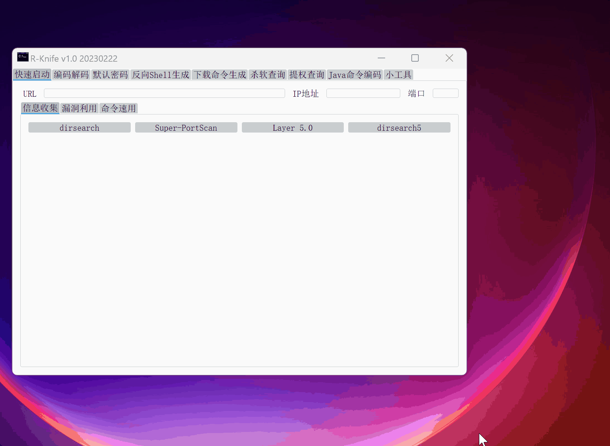

## 如何使用
下载exe双击即可
其他用户请自行打包，无技术含量，不做环境搭建介绍。



## 原理
该程序启动会加载conf/data.json。
数据格式
```
{
  "tab标签名": {
    "工具名称": "需要运行的命令或者exe文件绝对地址"
   },
  "命令速用": {  //此处的工具命令会进行复制。
    "工具名称": "需要运行的命令或者exe文件绝对地址"
   }
}
```
conf.ini中key为变量名 值为替换的内容，可自定定义。并在命令中使用{{}}调用
如：
```
conf.ini
python=C:/windwos/system32/python.exe

使用
{
  "信息手机": {
    "dirsearch": "{{python}} {{tools}}/dirsearch.py"
   }
}
```
系统自带变量
```
{{url}}  url地址
{{ip}}    ip
{{port}}    端口
{{tools}}  工具路径
```

## 免责声明

1. 本工具仅面向合法授权的企业安全建设行为，在使用本工具进行检测时，您应确保该行为符合当地的法律法规，并且已经取得了足够的授权。  
2. 如您在使用本工具的过程中存在任何非法行为，您需自行承担相应后果，我们将不承担任何法律及连带责任。 
3. 在使用本工具前，请您务必审慎阅读、充分理解各条款内容，限制、免责条款或者其他涉及您重大权益的条款可能会以加粗、加下划线等形式提示您重点注意。 除非您已充分阅读、完全理解并接受本协议所有条款，否则，请您不要使用本工具。
4. 您的使用行为或者您以其他任何明示或者默示方式表示接受本协议的，即视为您已阅读并同意本协议的约束。 

## 参考
https://github.com/ccc-f/PenKitGui

https://github.com/ghealer/GUI_Tools

https://mp.weixin.qq.com/s/rNqSfMNTYzJciNEjyY5_Rg


